# Wake up your Steam Deck remotely

## What and why?

This guide helps you setup your 1st gen Steam Deck (SD) placed in a Steam Docking Station (SDS) to wake up remotely, using a Raspberry Pi (RPi) with OTG capabilities to simulate a keyboard press. This repository consists of an overview of the process and [an image](https://github.com/sickmartian/sd-rpi-wakeup/releases) to use on the RPi plus links to guides and sources used to put it together.

This repository is open to contributions with alternative steps, troubleshooting information and information of differences that might apply to adapt this to a RPi 4, which should work in theory but it's untested.

My SD sits far from me inside a cabinet, and it's used as a media center so turning it on an off happens all the time. 2nd+ gen Steam Decks support waking the device but gen 1 never got this ability, unless you happen to have a special dock or a Steam Controller. While I got a hold of a Steam Controller, the fact that it uses batteries you have to buy or recharge is very annoying.

## Hardware needed

- Steam Deck
- Steam Docking Station (probably other docks will work as well)
- Raspberry Pi Zero 2 W (or Raspberry Pi 4, or any RPi that supports OTG should work but I this is only tried on RPi Zero 2 W) - If you don't have one you can find the cheapest closest to you with [rpilocator](https://rpilocator.com/), I got an [RPi Zero 2 W](https://rpilocator.com/?cat=PIZERO2) with SKU `SC0510` (no headers)
- MicroSD Card - To install the OS on the RPi
- [USB A to micro USB male to male cable](https://external-content.duckduckgo.com/iu/?u=https%3A%2F%2Fimages-na.ssl-images-amazon.com%2Fimages%2FG%2F02%2Faplusautomation%2Fvendorimages%2Fa05d726b-b8df-43d3-9228-b1045500d343.jpg._CB317619570_.jpg&f=1&nofb=1&ipt=9b2a6dbd925a67888c2c7f8806264efec3fff618e85c93e6e64fb202dd37d674&ipo=images) or a combination of [USB-A to micro USB female to male OTG cable](https://whatdoesthatlooklike.com/wp-content/uploads/2020/09/usb-otg-cable.jpg) and [USB-A to USB-A male to male cable](https://files.cablewholesale.com/hires/10u3-02.jpg)
- Wifi network the RPi supports (RPi Zero 2W only sees my 2.4 GHz network, but my RPi 3 B+ can see the 5 GHz one, so I assume the RPi 4 can too)
- PC - With MacOS or Linux ideally, in case you don't want to use the pre-packaged image it should be powerful enough to run docker and compile the linux kernel, I'm using a MacBook Pro with Apple Silicon and linking to some instructions I found useful.
- Some way to read the SD card - e.g. the PC has a slot for SD and the MicroSD card comes with an adapter, or a USB to MicroSD converter or similar
- (Optional) Power source for the RPi - I was able to use the SDS to power the RPi Zero 2W, it might not work with all RPis or all docks, and it's a nice to have to repurpose the RPi.
- (Optional) Case for the RPi - Depends on the RPi model, I bought mine with the RPi
- (Optional) HDMI mini to HDMI cable or adapter - Can help with troubleshooting or if you want to use the RPi for more stuff later on, we are not going to use it
- (Optional) Device to run bash scripts that wake or make the SD sleep - Can be the PC but I use an Android phone with Termux for convenience

## Software needed

- terminal - there is one preinstalled, I use [iTerm2](https://iterm2.com/)
- [OpenSSH](https://www.openssh.com/) - usually preinstalled
- [git](https://git-scm.com/) - usually preinstalled
- [rpi-imager](https://www.raspberrypi.com/software/)
- [pre-packaged image](https://github.com/sickmartian/sd-rpi-wakeup/releases) - get the latest from the releases section
- (Optional) [termux](https://github.com/termux/termux-app#installation)
- (Optional) [docker desktop](https://www.docker.com/products/docker-desktop/)

## General idea

Setting things up is a multi-step process, which gets a bit more complex since the Linux kernel [has a bug](https://github.com/raspberrypi/linux/issues/3977) which makes it so that even if the RPi is recognized as a keyboard, it doesn't think it can wake the device it's connected to.

Luckily we can see in the bug thread that [mdavaev](https://github.com/mdevaev) who works in the PiKVM project created a patch, and [jlian](https://github.com/jlian) provides step by step instructions on how to compile the kernel while applying the patch, and how to copy the new kernel into the RPi system.

There is a [pre-packaged image](https://github.com/sickmartian/sd-rpi-wakeup/releases) with these steps performed, it requires you to download a big file and putting it directly into your RPi as an OS.

First thing we are going to do is gather the SSH identities from the computers we want to connect to the RPi (the PC to prepare everything + whatever you want to use to wake the SD) then we are going to prepare the MicroSD card for the RPi in such a way we can connect with those devices, and we are going to connect everything together, find and connect to the RPi and try out the setup.

The "**(Optional) Manual Setup**" section points to the instructions from jilian so you can do this yourself, helpful if you have an RPi you want to repurpose, if you don't want the same OS I'm using, don't want to trust a random internet person, etc.

## SSH Keys gathering

Open up the terminal and let's check if you have an .ssh identity created

```bash
ls ~/.ssh/*.pub
```

If there are any files, like `/Users/<your_user>/.ssh/id_rsa.pub` or `/Users/<your_user>/.ssh/id_ed25519.pub` then you are all set.

**ONLY IF YOU DO NOT HAVE ANY** `.pub` files, you should run the following:

```bash
ssh-keygen # only run me if you do not have keys already!
```

And follow the steps, mostly pressing enter until it ends should be enough generating a key you don't need a password to use, which is nice and convenient if you don't share the PC with anyone else and the HD is encrypted. Here is how it looks:

```text
➜  ~ ssh-keygen
Generating public/private ed25519 key pair.
Enter file in which to save the key (/Users/<your_user>/.ssh/id_ed25519): /Users/<your_user>/.ssh/id_ed25519
Enter passphrase (empty for no passphrase):
Enter same passphrase again:
Your identification has been saved in /Users/<your_user>/.ssh/id_ed25519
Your public key has been saved in /Users/<your_user>/.ssh/id_ed25519.pub
The key fingerprint is:
SHA256:DNd0HTC8sDw6CslmFO+S2+tV0RyylSj1Kws7cf+XFxI <your_user>@<your_pc>.local
The key's randomart image is:
+--[ED25519 256]--+
|         .+o*+.. |
|    .   .ooOoo.  |
|     o. .o+o+.   |
|    . .+  +..E   |
|   o +  S.+.. .  |
|    O . o* + . . |
|   o = .+.. . . o|
|    . o. .   . .o|
|     .o.      ...|
+----[SHA256]-----+
```

Once done, save the public key generated on some temporal file, you can get it by doing:

```bash
cat ~/.ssh/id_ed25519.pub
```

Or if you had an `id_rsa.pub` file:

```bash
cat ~/.ssh/id_rsa.pub
```

If you want another device to be able to turn on the SD you can make the same steps on them, and save the public keys of those.

## Using the image

In your PC, insert the MicroSD card, open up `rpi-imager`:

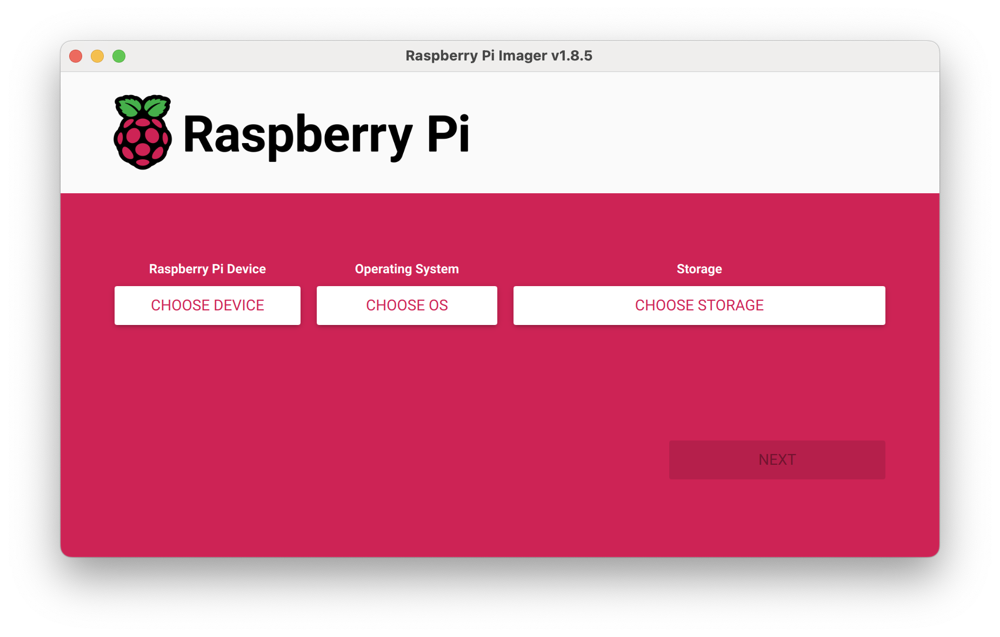

- Click on `CHOOSE DEVICE` and select the device you actually have.
- Click on `CHOOSE OS` and here you can chose the `rpi-sd-wake-no-config.img` file from this repository, unless you want to go the Manual setup route, on which case you get to choose an OS yourself.
- Click on `CHOOSE STORAGE` and select the MicroSD card

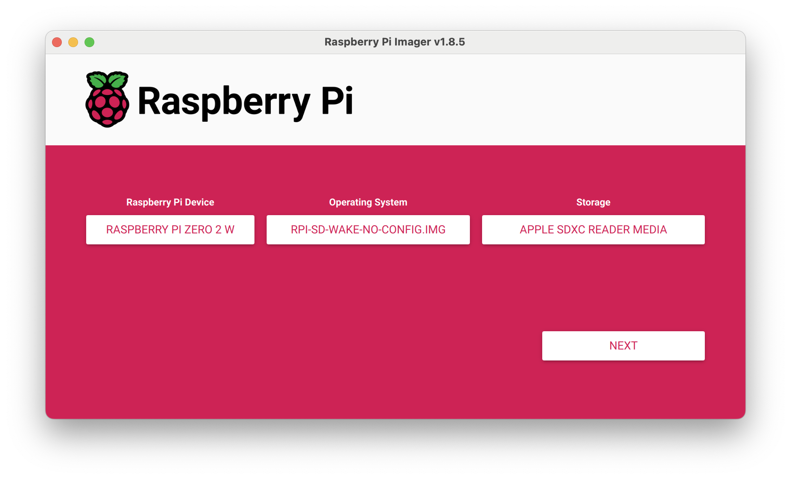

Now we click on `NEXT` and a popup should show up:

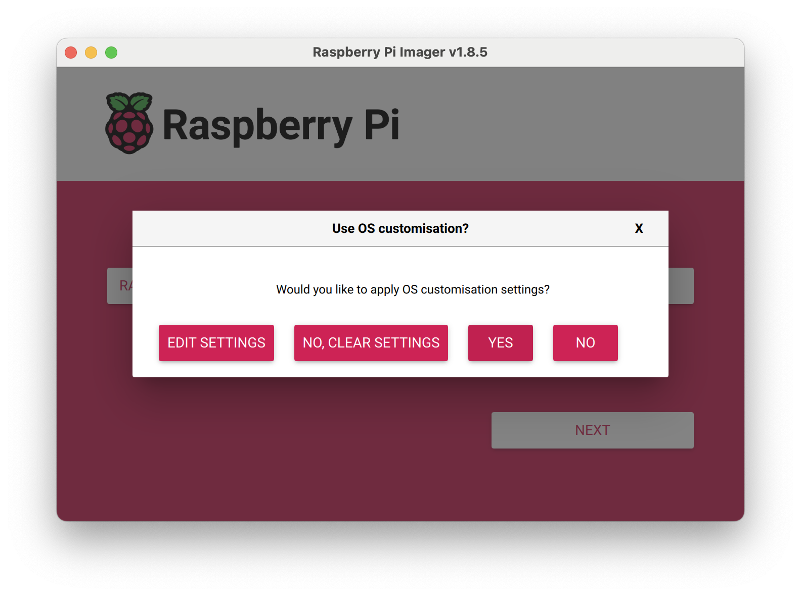

Here click on `EDIT SETTINGS`, and in the `GENERAL` tab fill up:

- hostname for the RPi (`rpi_hostname`): make sure it's unique and keep it somewhere as we are going to use it later
- username (`rpi_username`) and password: while the password won't be used normally save them both as well, as always make the password very complex and unique
- the id and password for the WiFi

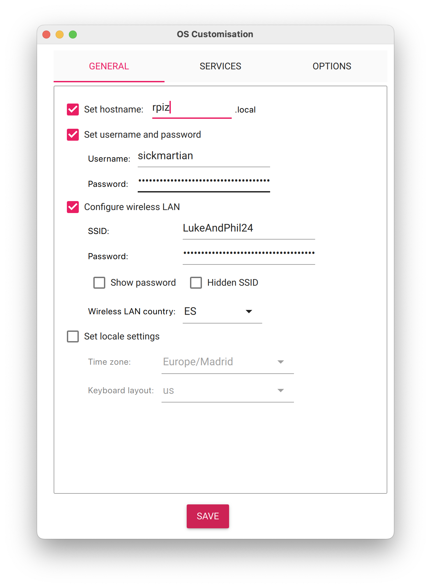

Then go to the `SERVICES` tab, and make sure `Enable SSH` is checked and `Allow public-key authentication only` is selected, then below, where the image says `asdasdasda` paste the ssh public keys we gathered on the previous step.

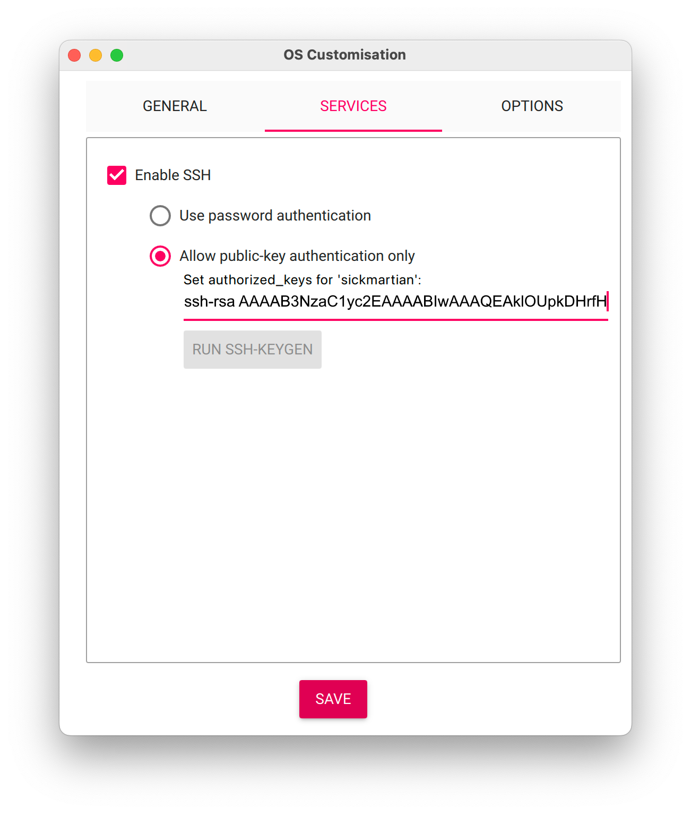

Once done click on `SAVE` and another popup should show up:

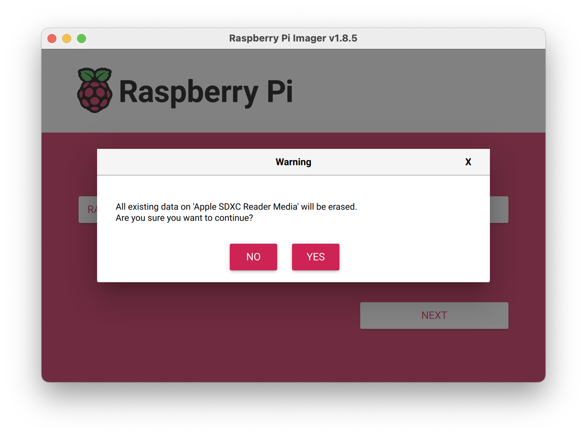

Confirm the target device is correct so we don't erase something important and click on `YES`, then it should take a while to copy the image into the MicroSD card.

Normally after the writing and verifying of the image in the MicroSD card this would be 'ejected', but to make sure you can open up Finder and check that in the Left Sidebar the Locations don't show up any extra things like `bootfs`, if they do click the icon to eject (⏏️) and remove the MicroSD card


### Connect the RPi

Insert the MicroSD card into the RPi, if you have a case for the RPi this is the time to put the RPi into the case, then insert the Micro USB end of the male to male cable into the port marked as **USB** of the RPi and the USB A end into one of the slots of the SDS.

The RPi led should light up:

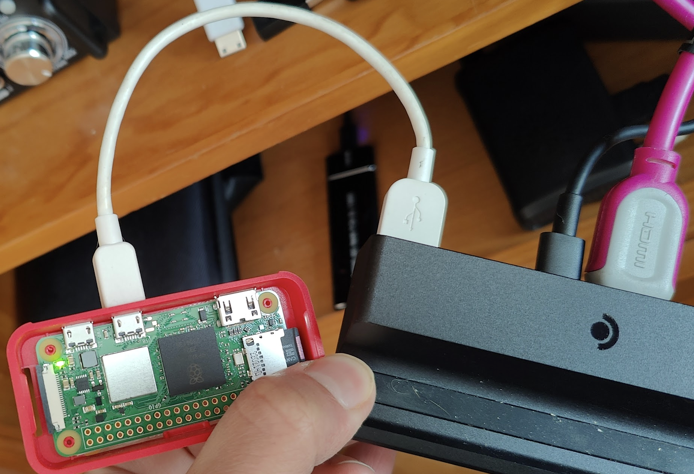

And after some minutes we should be able to find it, in MacOS and Linux this is pretty straightforward because of as using <our_selected_hostname>.local [should normally point to it](https://avahi.org/), if the WiFi setup was done correctly and both computers are on the same network. For other OSs you will have to check with the router for the IP of the RPi, usually in a section about DHCP leases.

We can try login in now, from our PC in the terminal we the script in the following line, replacing `<rpi_username>` and `<rpi_hostname>` with your own values, e.g. using the values from the screenshots it would be `ssh sickmartian@rpiz.local`:

```bash
ssh <rpi_username>@<rpi_hostname>.local
```

And it should leave you on a shell like this:

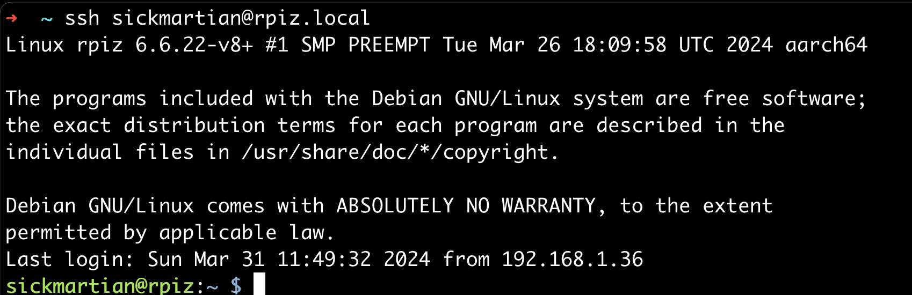

If you are **not** using the prepackaged image, now you get to go to the optional manual setup section, otherwise, we can already try it out, first make sure to turn on the SD with the RPi connected, then use a controller to put it to sleep, and now we can try to wake it up from this console:

```bash
sudo ./wake-up-sd.sh
```

It could take some seconds, but that script is sending the ESC key to the RPi, waking it up. The SD should've been powered on with the RPi/Keyboard attached for it to work.

You can now exit the ssh session by doing `exit` and from now on you can use a single line to do the waking up from your PC make sure to replace `<rpi_username>` and `<rpi_hostname>`:

```bash
ssh <rpi_user>@<rpi_hostname>.local -x "sudo ./wake-up-sd.sh"
```

## Optional - Manual setup

Only if you are not using the [pre-packaged image](https://github.com/sickmartian/sd-rpi-wakeup/releases), you should perform the following steps, there is no handholding here, no mention on how to edit files, go to root, etc, if you need this I assume you have some linux experience already.

Follow steps 1, 2 and 3 of [this guide](https://randomnerdtutorials.com/raspberry-pi-zero-usb-keyboard-hid/) to set the RPi as an USB Gadget. That done, we are 80% of the way there, and now all that's left is the next 80%.

You can follow the next steps from the above guide to create the python script and send keys, but then we hit [this issue](https://github.com/raspberrypi/linux/issues/3977) that doesn't let us wake the SD. Following the guidance of that thread, I changed the content of `/usr/bin/isticktoit_usb` to include the `wakeup_on_wreite` and the `bmAttributes`, leaving the 'functions' section like this:

```text
# Add functions here
mkdir -p functions/hid.usb0
echo 1 > functions/hid.usb0/protocol
echo 1 > functions/hid.usb0/subclass
echo 8 > functions/hid.usb0/report_length
echo -ne \\x05\\x01\\x09\\x06\\xa1\\x01\\x05\\x07\\x19\\xe0\\x29\\xe7\\x15\\x00\\x25\\x01\\x75\\x01\\x95\\x08\\x81\\x02\\x95\\x01\\x75\\x08\\x81\\x03\\x95\\x05\\x75\\x01\\x05\\x08\\x19\\x01\\x29\\x05\\x91\\x02\\x95\\x01\\x75\\x03\\x91\\x03\\x95\\x06\\x75\\x08\\x15\\x00\\x25\\x65\\x05\\x07\\x19\\x00\\x29\\x65\\x81\\x00\\xc0 > functions/hid.usb0/report_desc
echo 1 > functions/hid.usb0/wakeup_on_write
ln -s functions/hid.usb0 configs/c.1/
echo 0xa0 > configs/c.1/bmAttributes
# End functions
```

Now, for this to work, we also need to [apply the kernel patch from mdevaev](https://github.com/raspberrypi/linux/issues/3977#issuecomment-1200368214) which you can do following [jilian instructions](https://github.com/jlian/linux-kernel-cross-compile)

Once that's done, you can create the `wake-up-sd.sh` script with the following content

```bash
#!/bin/bash
# Send ESC
echo -ne "\0\0\x66\0\0\0\0\0" > /dev/hidg0
# Release
echo -ne "\0\0\0\0\0\0\0\0" > /dev/hidg0
```

and give it execution permissions and run it, to wake the SD:

```bash
chmod +x wake-up-sd.sh
sudo ./wake-up-sd.sh
```

## (Optional) Allow the Steam Deck to suspend w/o password

This is so we can get a single one liner that doesn't require a password to suspend the SD.

First, if you didn't already, [set up ssh following a guide, like this one](https://pimylifeup.com/steam-deck-ssh/). Next steps assume you have the IP of the SD (`sd_ip`) as well as the password for the `deck` user, that the user is able to run commands as root.

First thing to do is to ssh from the PC, like we did for the RPi, but now with username and password, replacing `<sd_ip>` with the IP of the SD.

```bash
ssh deck@<sd_ip>
# you will be asked for a password and land in:
# (deck@steamdeck ~)$
```

First objective now is to be able to connect to the SD without a password, for this we want to authorize the same public keys we wanted to use in the RPi on the SD, let's start by creating the `ssh` config directory if it doesn't exist

```bash
mkdir -p ~/.ssh
```

Then for each public key, you do the following (make sure to replace `<your_public_key>`):

```bash
echo '<your_public_key>' >> ~/.ssh/authorized_keys
```

Once that's done, let's try it out, going out of ssh:

```bash
exit
# should land you to your normal session
```

And connecting back again (make sure to replace `<sd_ip>`):

```bash
ssh deck@<sd_ip>
```

If shouldn't ask you for a password if we did things properly.

Now that we are back on the SD, our second objective is being able to suspend, this is done by `systemctl suspend`, but you can see we get a message requesting the password for the `deck` user

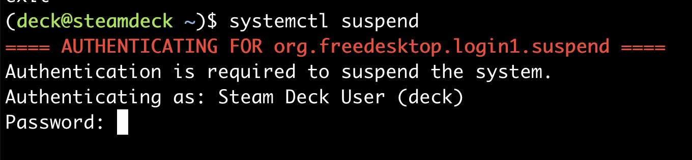

To remvoe this we need to add a rule to bypass check for our `deck` user

```bash
sudo su # should ask you for the password and land you into (B)(root@steamdeck deck)#
cd /etc/polkit-1/rules.d/
touch 85-bypass.rules
nano 85-bypass.rules
```

Which should land you into an editor, there you paste the following code:

```text
polkit.addRule(function(action, subject) {
        if (action.id == "org.freedesktop.login1.suspend" &&
                subject.isInGroup("deck")) {
                return polkit.Result.YES;
        }
});
```

And press `Ctrl+X` to exit, and `Y` to save and `ENTER` to confirm the filename

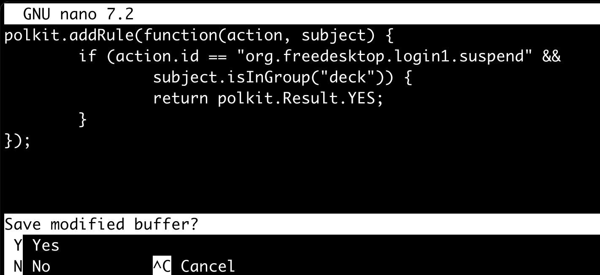

Now you do `exit` to leave the root shell and be back into `(deck@steamdeck ~)$` and we get to try out the suspend command again `systemctl suspend` which should suspend without requesting any password.

Doing `exit` again makes us go back to our PC, here we can try waking up the SD and making it sleep, make sure to replace `<rpi_username>`, `<rpi_hostname>` and `<sd_ip>`:

```bash
ssh <rpi_username>@<rpi_hostname>.local -x "sudo ./wake-up-sd.sh"
# wait some seconds for the RPi to wake up
ssh deck@<sd_ip> -x "systemctl suspend"
```

## (Optional) Create a remote-control with Termux

To complete the setup as demonstrated you will need [Termux](https://termux.dev/en/) and [Termux:Widget](https://f-droid.org/en/packages/com.termux.widget/) which should be installed via [F-Droid](https://f-droid.org/en/) .

Once installed in your Android device, open it up and run the steps from [SSH Keys gathering](#ssh-keys-gathering) and get the public key into the PC in some way like sending it to yourself as email or using a messaging app that is available on both the Android phone and the PC.

Now, from the PC log into the RPi and authorize it, making sure to replace `<termux_public_key>`:

```bash
ssh <rpi_username>@<rpi_hostname>.local
echo '<termux_public_key>' >> ~/.ssh/authorized_keys
exit
```

And do the same for the SD making sure to replace `<termux_public_key>` as well:

```bash
ssh deck@<sd_ip>
echo '<termux_public_key>' >> ~/.ssh/authorized_keys
exit
```

Now we can run the one liners we used in our PC in Termux and the SD should suspend and wake up.

To make this one-liners work from the Termux widget we have to create them as scripts in `.shortcuts/tasks`, you should be able to copy & paste the following into Termux, make sure to replace `<rpi_username>`, `<rpi_hostname>` and `<sd_ip>`:

```bash
cd ~ # make sure we are in the proper dir
mkdir -p .shortcuts/tasks # creates the directory
touch .shortcuts/tasks/sd-sleep.sh # creates the file
chmod +x .shortcuts/tasks/sd-sleep.sh # makes it executable
echo '#!/bin/bash' > .shortcuts/tasks/sd-sleep.sh # it's a bash script
echo 'date -Iseconds >> ~/sd-sleep.log' >> .shortcuts/tasks/sd-sleep.sh # log time
echo 'ssh deck@<sd_ip> -x "systemctl suspend" >> ~/.sd-sleep.log 2>&1' >> .shortcuts/tasks/sd-sleep.sh # suspend and log output and errors
touch .shortcuts/tasks/sd-wake-up.sh # creates the file
chmod +x .shortcuts/tasks/sd-wake-up.sh # makes it executable
echo '#!/bin/bash' > .shortcuts/tasks/sd-wake-up.sh # it's a bash script
echo 'date -Iseconds >> ~/sd-wake-up.log' >> .shortcuts/tasks/sd-wake-up.sh # log time
echo 'ssh <rpi_username>@<rpi_hostname>.local -x "sudo ./wake-up-sd.sh" >> ~/.sd-wake-up.log 2>&1' >> .shortcuts/tasks/sd-wake-up.sh # wake and log output and errors
```

Then install the Termux widget on your desktop, and press the refresh button if necessary, the scripts should show up there and you should be able to click them:

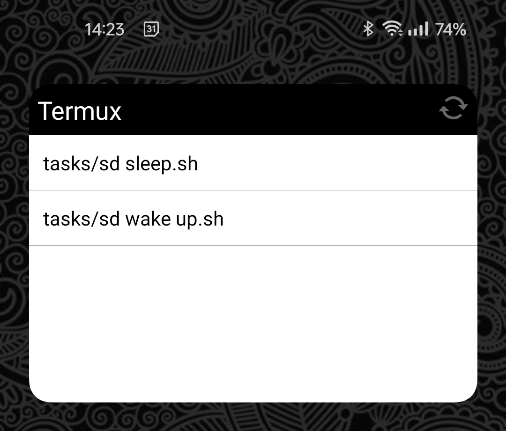

## Other considerations

If you are going to use a PC to control your SD and you are mostly working in desktop mode, I recommend to use [Barrier](https://github.com/debauchee/barrier) to share keyboard and mouse. I had issues with discovery of the server from the SD, but once it starts properly it's solid.

If you are going to use your Android phone to control your SD I highly recommend [KDE Connect](https://kdeconnect.kde.org/), for me at least it was already installed in the SD even, requires very small to no configuration and works great.

## Links and resources

- [rpilocator](https://rpilocator.com/)
- [The awesome PiKVM](https://pikvm.org/)
- [Waking up via RPi as keyboard issue](https://github.com/raspberrypi/linux/issues/3977)
- [jlian's guide for compiling the kernel with the patch](https://github.com/jlian/linux-kernel-cross-compile)
- [original guide used by jlian for 64 bits](https://github.com/geerlingguy/raspberry-pi-pcie-devices/tree/master/extras/cross-compile)
- [info about USB Gadget](https://docs.kernel.org/6.2/usb/gadget_hid.html)
- [more readable list of keys to send via the RPi](https://gist.github.com/MightyPork/6da26e382a7ad91b5496ee55fdc73db2)
- [helper used to create the image](https://github.com/Drewsif/PiShrink)
- [Barrier](https://github.com/debauchee/barrier)
- [KDE Connect](https://kdeconnect.kde.org/)
